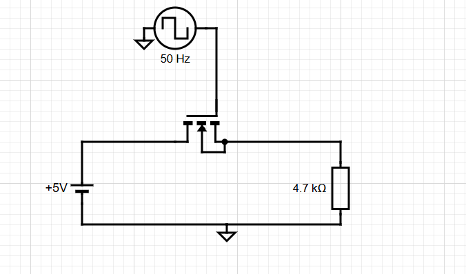
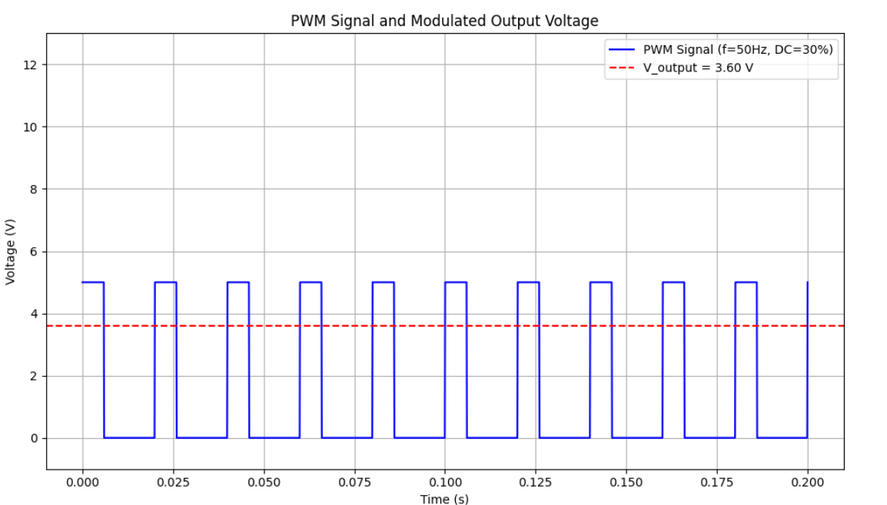
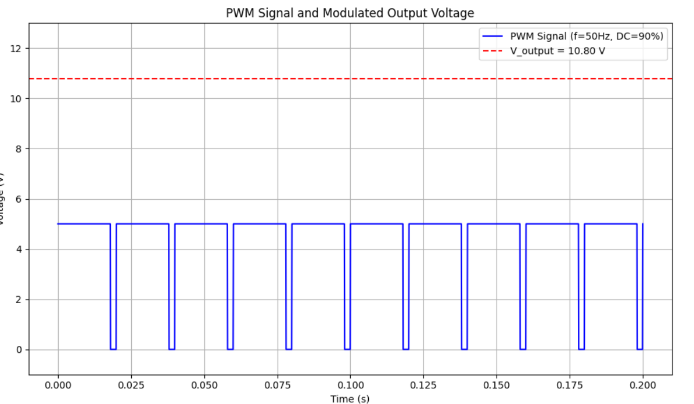
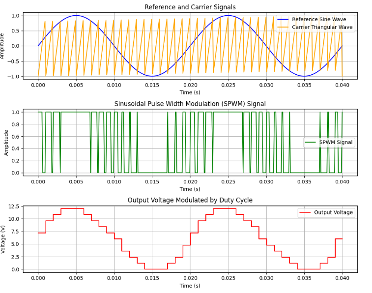

**The project is an implementation of SPWM for three phase induction motor drive (open loop), using the STM32f401RETX and stm32cubeide, this documentation is a guide to understand the concept and how i implemented it.**
# Guide to understand SPWM
## Introduction to PWM:
First we have to make sure that we understand the normal PWM that we usually use to drive a DC motor or to control the brightness of an LED. The PWM is a periodic square numerical signal, it can be in two states ON (5V or 3.3V) and OFF 0V, it has a frequency and a duty cycle which is the percentage of the period when the signal is ON.

Let’s take an example:
We have an input voltage source 12V with a switch like mosfet in series,  they are in series with the output load that can be a motor but we will keep it a simple resistor, this is a typical ideal circuit that can be controlled by pwm to drive the input voltage to the output with the desired percentage. We will use two different values of the duty cycle with a frequency set to 50 Hz.
<!-- LinkedIn should ignore this -->

If we set the duty cycle to 30%,we get in the output 3.6V.

Let’s try now 90% as duty cycle: 
Vout = 10.8V.  

the conclusion here is that the more big the duty cycle is, the big is the percentage of the input we can see in the output, which can be expressed by the following formula:
Vout = (Ton/(Ton+Tof))Vin  = DutyCycle*Vin.

So it’s simple ! If we want a certain voltage in the output we can change the duty cycle of the pwm.
That’s awesome but don’t forget that our goal is to get a sinusoidal form in the output, but how can that be possible ? 

## What is SPWM ?
Stands for sinusoidal pulse-width modulation, it’s a technique used to modulate an input signal to get an output signal with sinusoidal form, it is used in many applications like the Power inverters and AC motor drives.

The most known method to generate a SPWM is using two signals: one is reference signal which is a sinusoid, The reference frequency determines the fundamental frequency of the output sine wave., and a triangular wave called carrier signal that has a bigger frequency, and then we do comparison between the tow; when the reference signal is superior the spwm takes the value HIGH otherwise it takes LOW, and then the modulated signal will be approximately a sine wave and its quality depends on the carrier wave signal frequency and it’s representing the resolution of the spwm, if the carrier wave frequency is much bigger than reference signal frequency then the output appears smoother because the carrier has more cycles to approximate each part of the sine wave.

This is how it looks: 

Note that all the process mentioned before are done by software algorithms and not  hardware components, there are methods based on electronics components like comparators and oscillators, but it’s better to use software implementation especially with the powerful microcontrollers that we have nowadays. 

So if we want to think about an algorithm that can implement a spwm, it will look like this : 

1. Generate Reference and Carrier Signals:
    - Calculate reference sine wave values using mathematical functions based on reference frequency.
    - Calculate carrier wave (triangular wave) values using mathematical functions based on carrier frequency.

2. Initialize PWM Peripheral:
    - Configure the PWM output settings (frequency, resolution, etc.).

3. Enter the Main Control Loop:
    - While True:
        - Compare the current value of the reference sine wave (sin[i]) with the carrier wave (triangle[i]).
        - If sin[i] > triangle[i]:
            - Set PWM output to HIGH.
        - Else:
            - Set PWM output to LOW.
        - Increment i to move to the next sample point in the waveforms.

## My implementation: 
In this repo i implemented an SPWM for three phase induction motor controller using the STM32F4 nucleo board, so i had to generate 6 SPWMs, but the program is generating only three pwms and a logical Non port takes care of the rest, because in the 3 phase VFDs architecture the top 3 mosfets always complementary to the bottom ones. 

So I will explain to you how I generated One spwm, and then how to handle the three phase aspect.

To begin with, the first step was to generate the sine wave values. I wanted to create 128 discrete values (128 is good resolution but you can generate more than 128 if you want more precision and smoothness, but be careful because it’s a tradeoff between the precision and the memory) that represent one full cycle of a sine wave (from 0° to 360°). This was done by calculating the sine of each angle using the formula:
$\sin(\theta) = \sin\left(\frac{2\pi \cdot i}{128}\right)$, 
it ranges from 0 to 127, corresponding to the angles from 0° to 360°, These values were then stored in a look-up table.  
Since the STM32F4 uses a timer-based PWM module where the duty cycle is controlled by the ARR (Auto-Reload Register which corresponds to one periode in our case is 1599) and CCR (Capture/Compare Register that corresponds to the duty cycle ), the next step was to scale the sine values to a range that the timer can use to set the PWM duty cycle. The duty cycle is a fraction of the total period, so the sine values, which range from -1 to 1, needed to be scaled.  
The formula for scaling the sine value to a duty cycle is:
$\sin(\theta) = \frac{(\sin(\theta) + 1)}{2} \times ARR$
This formula shifts the sine wave from a range of [−1,1] to [0,1] and then multiplies it by the value in the ARR register to generate the appropriate duty cycle values and then you have also to avoid any floating point in the calculated values because basically they will be hold by duty cycle register which accepts only integers(you can’t tell a timer to count 1.2 times). The ARR register is set to the maximum value, which controls the period of the PWM signal.

To handle the aspect of the carrier wave, I didn't explicitly generate or store a separate table for the carrier values. Instead, I leveraged the sine wave table and iterated through it at a higher frequency relative to the reference signal. Here's how it worked:

-  The sine wave table already contained 128 points representing one cycle of a sine wave, scaled to match the timer's range using the ARR value.
-  To create the carrier wave effect, I incremented through the sine wave table at a certain frequency much higher than the reference frequency, ensuring proper phasing between the three timers to maintain synchronization and generate accurate SPWM signals.

So i had to set another timer with interruption, its interrupt handler will be responsible to change the pwm timer duty cycle with next value, the frequency of updating the duty cycles calculated via the formula: **UpdateFreq = ValuesTableLength * OutputFrequency** In order To produce a sine wave of the desired output frequency the table must be iterated through exactly once per period of that frequency.  
If we want to have an output signal with 50 hz (which is a typical value in AC lines frequencies) then the updating frequency will be 128*50 = 6400 Hz, based on that we set the timer ARR.  
The input frequency will be determined using an ADC, which reads the analog signal from a potentiometer to set the desired SPWM frequency.

- Those are the main parts of my code: 
- **Initialization:**
  - All timers, ADC, and peripherals are configured during initialization.
  - PWM signals are started on TIM1, TIM2, and TIM3.

- **ADC Reading and Frequency Scaling:**
  - The ADC reads the value from a potentiometer (or another analog source), which is then scaled to determine the desired frequency.
  - The ADC value is used to adjust the Auto-Reload Register (ARR) of TIM4, thereby controlling the frequency of the SPWM.
  - The formula `ARR = (16 MHz / (Frequency × LUT_Size)) - 1` ensures that LUT updates match the desired SPWM frequency.
  
- **Interrupt Handling (TIM4):**
  - The TIM4 interrupt handler updates the Compare Capture Registers (CCRs) of TIM1, TIM2, and TIM3.
  - The CCR values are modified to introduce phase offsets between the three timers, enabling three-phase SPWM signal generation.
  - These phase offsets are determined using the LUT values, ensuring that the PWM signals on each timer are synchronized with the appropriate phase shifts.

- **SPWM Generation (TIM1, TIM2, TIM3):**
  - TIM1, TIM2, and TIM3 generate the SPWM signals based on the updated CCR values from the interrupt handler.
  - The phase offsets on each timer allow for the generation of three distinct, evenly spaced SPWM signals.
  - These signals are used to drive the output, with the duty cycle of each signal determined by the LUT values.

I realy encourage you to watch this [youtube video](https://www.youtube.com/watch?v=AjN58ceQaF4) to understand how to work with PWM on stm32 mcus using the stm32cubeide. 

